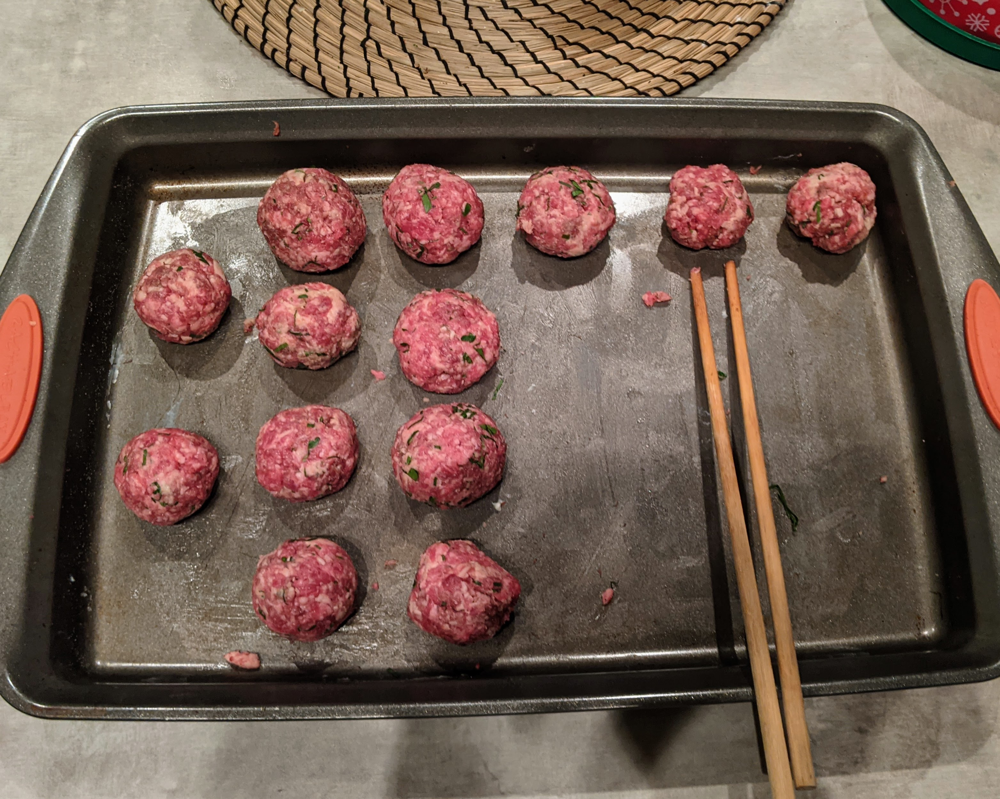

# Short Rib Meatballs
Juicy meatballs with enough flavor to be the star of a dish.
## Ingredients
- **~1lb** beef short ribs
- **~1/3 cup** bread crumbs
- **~1/3 cup** cream
- **~1/3 cup** Parmesan or Pecorino, or both
- **~1 tsp** garlic powder
- **~1 tsp** onion powder
- **~1/2 tsp** cayenne pepper
- black pepper, to taste
- Fine chop parsley, to taste

## Steps
1. Grind **cold** short ribs on medium grind. Freeze grinder parts beforehand to avoid a sticky fatty mess.
1. In a small bowl, combine bread crumbs and cream to hydrate bread crumbs
1. In a large bowl, mix ground short rib, seasonings, and hydrated bread crumbs. Optionally leaving the bread crumbs in clumps provides nice heterogeneity in the final product.
	- Pan sear up a couple pieces of the mix to test the seasoning. This is fun, practical, and delicious.
1. Leave in fridge overnight
1. Form into balls a bit bigger than a golf ball
1. Sear on medium high heat until brown

